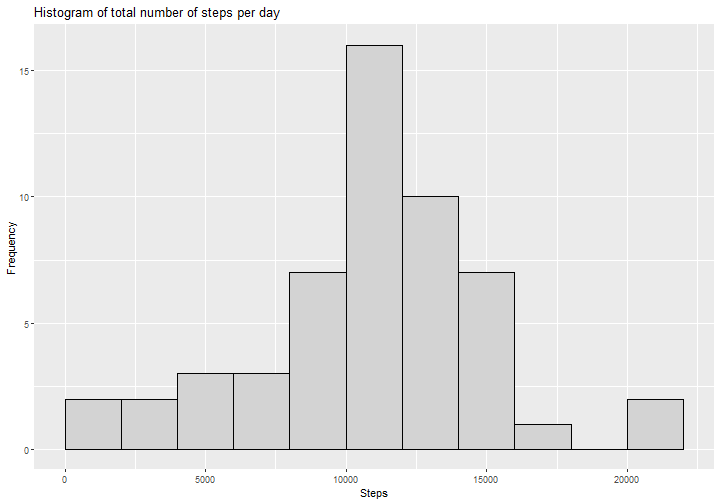
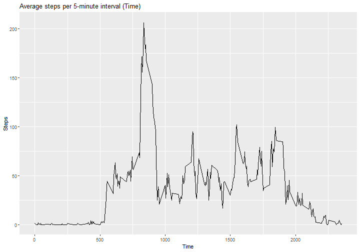
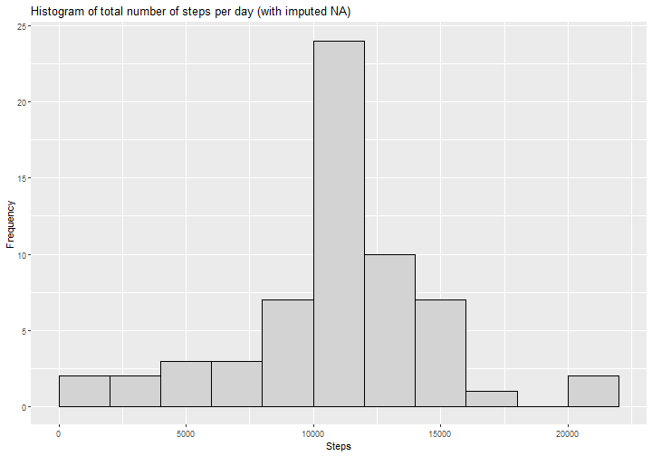
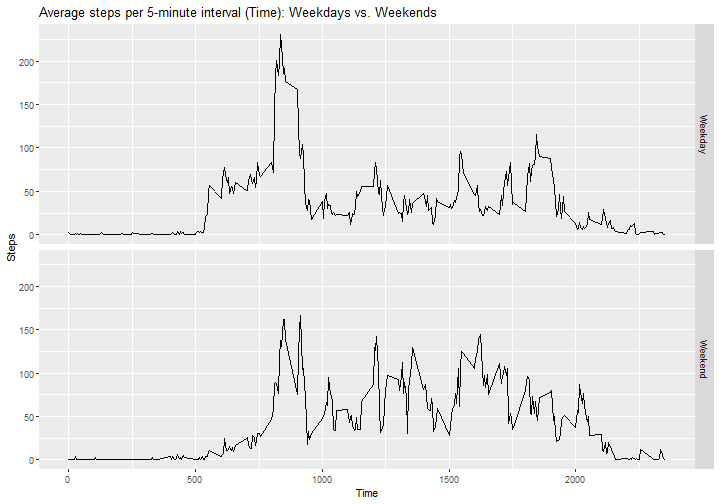

### Course Project Instructions

*1. Code for reading in the dataset and/or processing the data*
*2. Histogram of the total number of steps taken each day*
*3. Mean and median number of steps taken each day*
*4. Time series plot of the average number of steps taken*
*5. The 5-minute interval that, on average, contains the maximum number of steps*
*6. Code to describe and show a strategy for imputing missing data*
*7. Histogram of the total number of steps taken each day after missing values are imputed*
*8. Panel plot comparing the average number of steps taken per 5-minute interval across weekdays and weekends*
*9. All of the R code needed to reproduce the results (numbers, plots, etc.) in the report*

### 1. Loading and preprocessing the data set


```r
activity<-read.csv("activity.csv")

# Libraries
library(ggplot2)
library(dplyr)
```

Exploring the basic structure of the data set

```r
# Structure
    dim(activity)
```

```
## [1] 17568     3
```

```r
    names(activity)
```

```
## [1] "steps"    "date"     "interval"
```

```r
    head(activity)
```

```
##   steps       date interval
## 1    NA 2012-10-01        0
## 2    NA 2012-10-01        5
## 3    NA 2012-10-01       10
## 4    NA 2012-10-01       15
## 5    NA 2012-10-01       20
## 6    NA 2012-10-01       25
```

```r
    str(activity)
```

```
## 'data.frame':	17568 obs. of  3 variables:
##  $ steps   : int  NA NA NA NA NA NA NA NA NA NA ...
##  $ date    : chr  "2012-10-01" "2012-10-01" "2012-10-01" "2012-10-01" ...
##  $ interval: int  0 5 10 15 20 25 30 35 40 45 ...
```

```r
# Verifying the number of NA records
    mean(is.na(activity$steps))
```

```
## [1] 0.1311475
```

### 2. Total number of steps taken per day 

**2.1. Number of steps per day**


```r
# Creating and printing the number of steps per day
    StepsPerDay <- aggregate(activity$steps, list(activity$date), FUN=sum)
    colnames(StepsPerDay) <- c("Date", "Steps")
    StepsPerDay
```

```
##          Date Steps
## 1  2012-10-01    NA
## 2  2012-10-02   126
## 3  2012-10-03 11352
## 4  2012-10-04 12116
## 5  2012-10-05 13294
## 6  2012-10-06 15420
## 7  2012-10-07 11015
## 8  2012-10-08    NA
## 9  2012-10-09 12811
## 10 2012-10-10  9900
## 11 2012-10-11 10304
## 12 2012-10-12 17382
## 13 2012-10-13 12426
## 14 2012-10-14 15098
## 15 2012-10-15 10139
## 16 2012-10-16 15084
## 17 2012-10-17 13452
## 18 2012-10-18 10056
## 19 2012-10-19 11829
## 20 2012-10-20 10395
## 21 2012-10-21  8821
## 22 2012-10-22 13460
## 23 2012-10-23  8918
## 24 2012-10-24  8355
## 25 2012-10-25  2492
## 26 2012-10-26  6778
## 27 2012-10-27 10119
## 28 2012-10-28 11458
## 29 2012-10-29  5018
## 30 2012-10-30  9819
## 31 2012-10-31 15414
## 32 2012-11-01    NA
## 33 2012-11-02 10600
## 34 2012-11-03 10571
## 35 2012-11-04    NA
## 36 2012-11-05 10439
## 37 2012-11-06  8334
## 38 2012-11-07 12883
## 39 2012-11-08  3219
## 40 2012-11-09    NA
## 41 2012-11-10    NA
## 42 2012-11-11 12608
## 43 2012-11-12 10765
## 44 2012-11-13  7336
## 45 2012-11-14    NA
## 46 2012-11-15    41
## 47 2012-11-16  5441
## 48 2012-11-17 14339
## 49 2012-11-18 15110
## 50 2012-11-19  8841
## 51 2012-11-20  4472
## 52 2012-11-21 12787
## 53 2012-11-22 20427
## 54 2012-11-23 21194
## 55 2012-11-24 14478
## 56 2012-11-25 11834
## 57 2012-11-26 11162
## 58 2012-11-27 13646
## 59 2012-11-28 10183
## 60 2012-11-29  7047
## 61 2012-11-30    NA
```

**2.2. Histogram of the total number of steps taken each day**


```r
# Plotting the histogram
    hist1 <- ggplot(StepsPerDay, aes(Steps))
    hist1 + geom_histogram(boundary = 0, binwidth = 2000, col = "black", fill = "lightgray") + 
    ggtitle("Histogram of total number of steps per day") + xlab("Steps") + ylab("Frequency")
```




**2.3. Mean and median of total number of steps taken per day**


```r
    # Mean
    print(paste("Mean of total number of steps per day: ",mean(StepsPerDay$Steps, na.rm=TRUE)))
```

```
## [1] "Mean of total number of steps per day:  10766.1886792453"
```

```r
    #Median
    print(paste("Median of total number of steps per day: ",median(StepsPerDay$Steps, na.rm=TRUE)))
```

```
## [1] "Median of total number of steps per day:  10765"
```

### 3. Average daily activity pattern

**3.1. Time series plot of the 5 minute interval (x-axis) and average number of steps taken, averaged across all days (y-axis)**


```r
    # Creating a table with steps per 5-minute interval (Time)
    StepsPerTime <- aggregate(steps ~ interval, data = activity, FUN = mean, na.action = na.omit)
    # The line plot
    time1 <- ggplot(StepsPerTime, aes(interval, steps))
    time1 + geom_line() + 
    ggtitle("Average steps per 5-minute interval (Time)") + xlab("Time") + ylab("Steps")
```



**3.2. 5-minute interval (on average across all the days) with the maximum number of steps**


```r
    StepPerTimeTable <- tbl_df(StepsPerTime)
    StepPerTimeTable %>% select(interval, steps) %>% filter(steps==max(StepPerTimeTable$steps))
```

```
## # A tibble: 1 x 2
##   interval steps
##      <int> <dbl>
## 1      835  206.
```
   
### 4. Imputing missing values

**4.1. Total number of missing values in the data set**


```r
    sum(is.na(activity$steps))
```

```
## [1] 2304
```

**4.2. Replace missing values with the values of the average 5-minute interval**  
  
*CompleteSteps* is the new column without missing values.


```r
    # Creating new column named "CompleteSteps"
    activity$CompleteSteps <- ifelse(is.na(activity$steps),
                                     StepsPerTime$steps[match(activity$interval, StepsPerTime$interval)],                                             activity$steps)
```

**4.3. New data set that is equal to the original data set but with the missing data filled in**   


```r
    # New data set activityComplete
    activityComplete <- data.frame(steps=activity$CompleteSteps, interval=activity$interval, date=activity$date)
    print("First 6 lines form activityComplete data set:")
```

```
## [1] "First 6 lines form activityComplete data set:"
```

```r
    head(activityComplete)
```

```
##       steps interval       date
## 1 1.7169811        0 2012-10-01
## 2 0.3396226        5 2012-10-01
## 3 0.1320755       10 2012-10-01
## 4 0.1509434       15 2012-10-01
## 5 0.0754717       20 2012-10-01
## 6 2.0943396       25 2012-10-01
```

**4.4.1. Histogram of the total number of steps taken each day with missing data filled in**  


```r
    # Data
    StepsPerDayComplete <- aggregate(activityComplete$steps, list(activityComplete$date), FUN=sum)
    colnames(StepsPerDayComplete) <- c("Date", "Steps")
    # Plotting the histogram
    hist2 <- ggplot(StepsPerDayComplete, aes(Steps))
    hist2 + geom_histogram(boundary=0, binwidth=2000, col="black", fill="lightgray") + 
    ggtitle("Histogram of total number of steps per day (with imputed NA)") + xlab("Steps") + ylab("Frequency")
```



**4.4.2. Mean and median total number of steps taken per day**


```r
    # Mean
    print(paste("Mean of total number of steps per day (imputed NA): ",mean(StepsPerDayComplete$Steps)))
```

```
## [1] "Mean of total number of steps per day (imputed NA):  10766.1886792453"
```

```r
    #Median
    print(paste("Median of total number of steps per day (imputed NA): ",median(StepsPerDayComplete$Steps)))
```

```
## [1] "Median of total number of steps per day (imputed NA):  10766.1886792453"
```

**4.4.3. Do these values (mean and median) differ from the estimates from the first part of the assignment? What is the impact of imputing missing data on the estimates of the total daily number of steps?**  


```r
    print(paste("Difference in Mean of total number of steps per day (not-imputed vs imputed NA): ",
    mean(StepsPerDay$Steps, na.rm = TRUE) - mean(StepsPerDayComplete$Steps)))
```

```
## [1] "Difference in Mean of total number of steps per day (not-imputed vs imputed NA):  0"
```

```r
    #Median
    print(paste("Difference in Median of total number of steps per day (not-imputed vs imputed NA): ",
    median(StepsPerDay$Steps, na.rm = TRUE) - median(StepsPerDayComplete$Steps)))
```

```
## [1] "Difference in Median of total number of steps per day (not-imputed vs imputed NA):  -1.1886792452824"
```

There was no impact of the missing data in the mean and a little impact in the median. However, it is important to note that the method used to impute missing values can change these results.

### 5. Are there differences in activity patterns between weekdays and weekends?

**5.1. Create a new factor variable in the dataset with two levels - "weekday" and "weekend" indicating whether a given date is a weekday or weekend day.**


```r
    # Date in correct format
    activityComplete$date <- as.Date(activityComplete$date, format = "%Y-%m-%d")
    # Creating the variable with weekdays name
    activityComplete$WeekDay <- weekdays(activityComplete$date)
    # Creating the variable indicating weekday or weekend
    activityComplete$DayType <- ifelse(activityComplete$WeekDay == 'Saturday' |
                                       activityComplete$WeekDay == 'Sunday',
                                       'Weekend',
                                       'Weekday')
    # The first 15 records in data set
    head(activityComplete, n=15)
```

```
##        steps interval       date WeekDay DayType
## 1  1.7169811        0 2012-10-01  Monday Weekday
## 2  0.3396226        5 2012-10-01  Monday Weekday
## 3  0.1320755       10 2012-10-01  Monday Weekday
## 4  0.1509434       15 2012-10-01  Monday Weekday
## 5  0.0754717       20 2012-10-01  Monday Weekday
## 6  2.0943396       25 2012-10-01  Monday Weekday
## 7  0.5283019       30 2012-10-01  Monday Weekday
## 8  0.8679245       35 2012-10-01  Monday Weekday
## 9  0.0000000       40 2012-10-01  Monday Weekday
## 10 1.4716981       45 2012-10-01  Monday Weekday
## 11 0.3018868       50 2012-10-01  Monday Weekday
## 12 0.1320755       55 2012-10-01  Monday Weekday
## 13 0.3207547      100 2012-10-01  Monday Weekday
## 14 0.6792453      105 2012-10-01  Monday Weekday
## 15 0.1509434      110 2012-10-01  Monday Weekday
```

**5.2. Two time series plot of the 5-minute interval (x-axis) and the average number of steps taken averaged, across weekday days or weekend days (y-axis).**  


```r
    # Creating table with total steps per time across weekday days or weekend days
    SPTCompTable <- aggregate(steps ~ interval + DayType, data = activityComplete, FUN = mean, na.action=na.omit)
    # The line plot
    time2 <- ggplot(SPTCompTable, aes(interval, steps))
    time2 + geom_line() + 
    ggtitle("Average steps per 5-minute interval (Time): Weekdays vs. Weekends") + xlab("Time") + ylab("Steps") + facet_grid(DayType ~ .)
```


